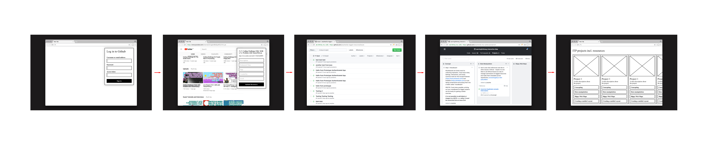

# DISCLAIMER: still testing! <3 <3 <3

# ITP Resource Collector

A browser plugin that allows you to save, tag and manage learning materials from across the web 

## Overerview/User flow



## Setup

Install the dependencies:
```
npm install
```

Terminal window 1: Start nodejs
```
npm start
```

Terminal window 2: Start mongodb

If you don't have mongodb installed on your machine go to: [install mongodb with homebrew](https://docs.mongodb.com/manual/tutorial/install-mongodb-on-os-x/#install-mongodb-community-edition-with-homebrew)
```
mongod
```

Go to:
```
http:127.0.0.1:5000
```

See the posts appearing at:

[https://github.com/joeyklee/itp-tagged-resources/issues](https://github.com/joeyklee/itp-tagged-resources/issues)

## Workflow

User auths app ==> token is generated & stored to db w/ user profile ==> each time user makes request we use their access token to make posts to the itp-tagged-resources issues


## Example: Create an issue from the Commandline

see: https://developer.github.com/v3/issues/#create-an-issue

First login in to [Github](https://github.com) and generate your personal access token. You'll need to make sure to set the permissions on that token to `[x] public_repo`.

Then, in your terminal: 

```
curl --header "Content-Type: application/json" \
     --header "Authorization: token <Your Personal Access Token>" \
     --data '{
        "title": "Testing 1",
        "body": "## Description <br><br> hello, I am a description. <br><br> ## Tags <br> [`beginner`, `30 min`, `sketching`, `concept`] <br><br> ## URL <br><br> https://www.youtube.com/channel/UCvjgXvBlbQiydffZU7m1_aw ",
        "assignees": [],
        "labels": []
        }' \
     --request POST https://api.github.com/repos/joeyklee/itp-tagged-resources/issues
```

`Where`:

* `curl`: the command to make requests via your terminal
* `--header "Content-Type: application/json"`: setting the header to send JSON as data
* `--header "Authorization: token <Your Personal Access Token>"`: adding auth to your POST request, you'll need to fill in `<Your Personal Access Token>` with your personal access token generated on Github. To do this:
    - Go to: Github.com ==> settings (top right corner drop down menu) ==> developer settings ==> personal access tokens ==> generate new token ==> input: `<some token name>` and **make sure to check the checkbox where is says** select scopes > repo > "`public_repo`" (otherwise your access token won't be able to post to public repos)
    - For a browser plugin, this will be handled via Oauth into the browser plugin.
* `--data {...}`: the data flag is followed by a json with the data for the github issue. The min an issue needs is the `title` property.
* `--request POST https://api.github.com/repos/joeyklee/itp-tagged-resources/issues`: here, we make a POST request to the github api to post in our data to the issues of `itp-tagged-resources`


## References

- See: https://github.com/sitepoint-editors/OpenAuthWithPassport
- https://github.com/passport/express-4.x-facebook-example/blob/master/server.js
- https://stackoverflow.com/questions/25654617/using-the-returned-token-to-access-github-api
- https://developer.github.com/v3/guides/basics-of-authentication/#registering-your-app
- https://github.com/jaredhanson/passport-github
- https://github.com/octokit/rest.js
- http://fajitanachos.com/Authenticating-with-the-GitHub-API/
- http://mherman.org/blog/2013/11/10/social-authentication-with-passport-dot-js/#setup
- https://scotch.io/tutorials/the-easiest-way-to-add-authentication-to-any-app

