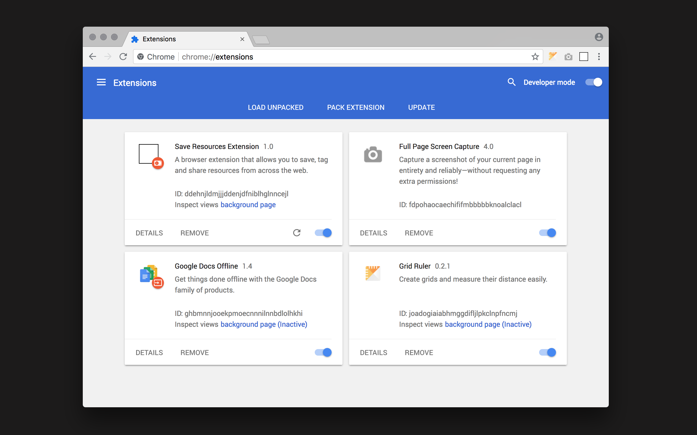
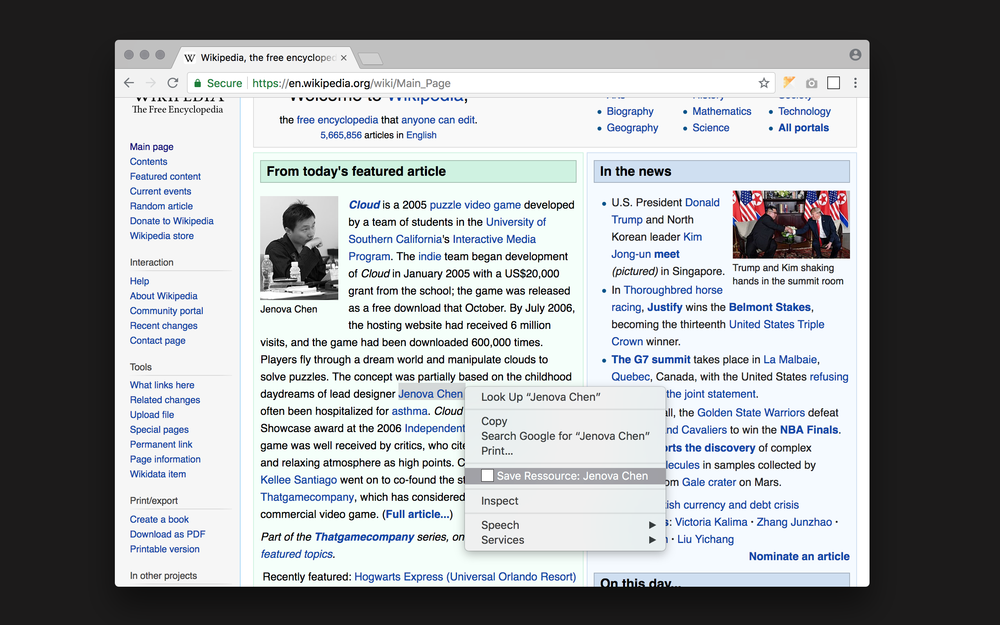

# Save Resources Extension for Chrome

A browser extension that allows you to save, tag and share resources from across the web. 

## Setup

NOTE: Since you don't have mongo running, the data won't go anywhere and you'll probably get an error message.

to run the server and mongodb instance:

open a terminal window and run
```
mongod
```
if you don't have mongodb, then install it via the [docs](https://docs.mongodb.com/manual/installation/). The easiest way is via [homebrew, `brew install mongodb`](https://docs.mongodb.com/manual/tutorial/install-mongodb-on-os-x/#install-mongodb-community-edition-with-homebrew)

Next, you're going to navigate to the tagging server directory:
```
cd itp-resource-collector/components/tagging-server
npm install
npm start
```

Then throw your browser plugin into the chrome://extensions window
```
open chrome browser
open new tab and navigate to chrome://extensions
toggle the "developer mode" toggle button (top-right corner)
drag and drop the folder "tagging-extension" 
```



## Use cases

### Option 1


### Option 2



